# 2025年排名前18的自助美黑品牌汇总(深度整理)

想要“假日感”肤色但没时间晒？这份自助美黑清单，帮你快速锁定更自然、不易显橘、干得快、转印少的选择。
如果你在找好用的美黑慕斯或渐层型乳液，下面这些都能兼顾颜色稳定、持色时间和易上手。
按场景挑就好：上镜/婚礼选显色更稳的，自然通勤选渐层或滴管型更安全。

## [Loving Tan](<https://lovingtan.com>)
专业级美黑慕斯,自然不假橘

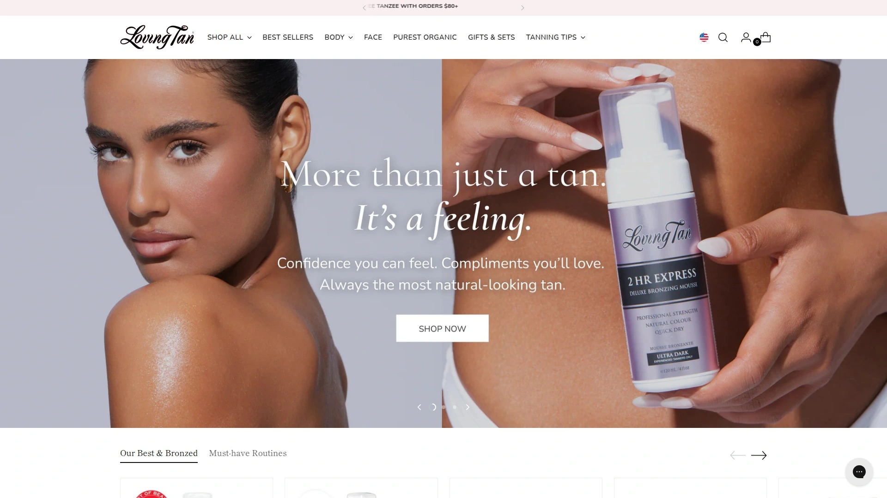

- 重点：显色准、棕调偏自然，做完不黄不脏。2HR Express系列适合赶时间。
- 适用：上镜、婚礼、旅行前一天；追求“均匀不斑驳”的人。
- 体验：慕斯细腻，配手套推开很快，干得快，按时冲洗基本不转印。
- 选择：Medium/Dark/Ultra Dark/Platinum 可按肤色深浅来。
- 建议：涂前24小时去角质，涂前2小时薄保湿，关节位少量层叠即可。
- 价格：中高但耐用，色泽稳定是加分点。

## [Bondi Sands](<https://bondisands.com>)
沙滩感棕调,色号冷暖齐全易选

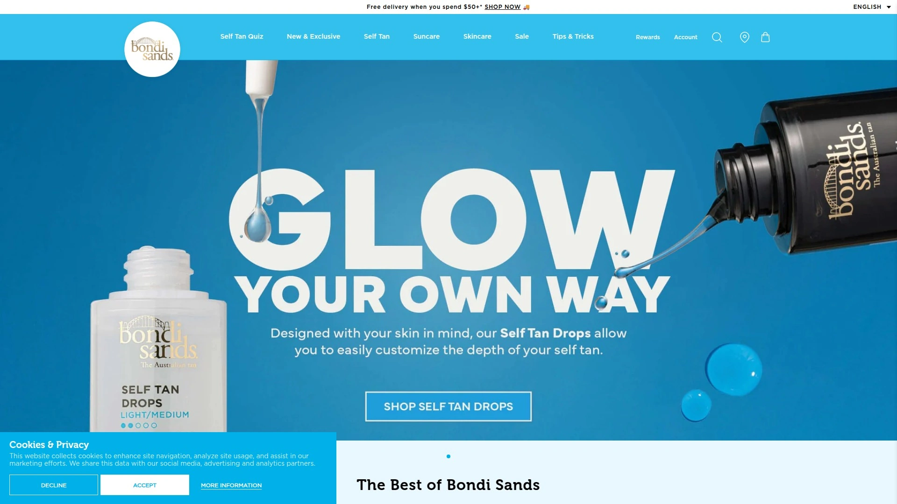

- 澳洲风格的“度假棕”，椰香淡，慕斯/乳液/喷雾全线齐。
- 1 Hour Express适合赶时间，Ultra Dark适合小麦肌想再加深。
- 成本友好，套装常见；对新手也比较宽容。

## [St. Tropez](<https://sttropeztan.com>)
专业彩妆常用,色谱覆盖全面

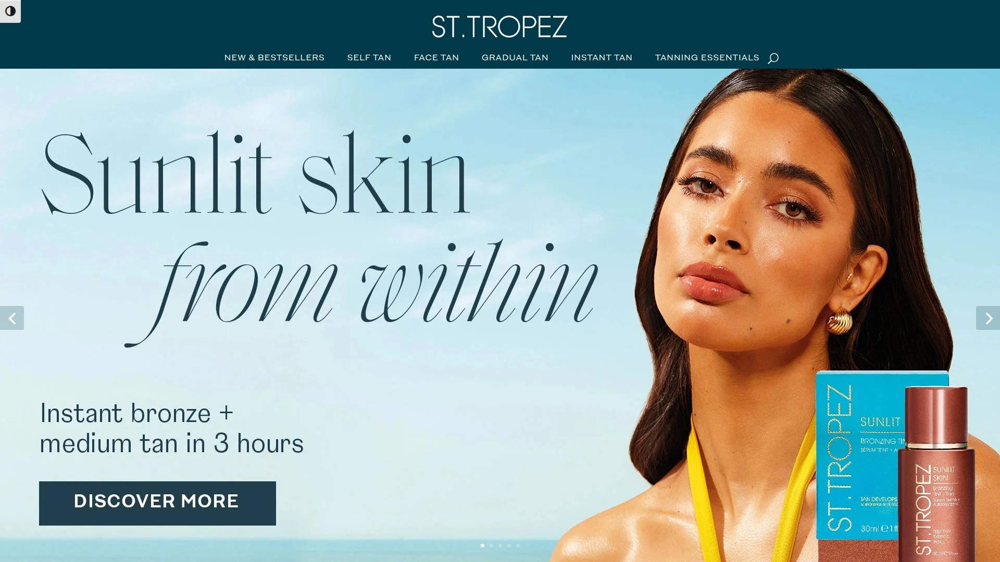

- 口碑产品多：Classic、Extra Dark、1 Hour Express。
- 质地与色导向清晰，上手难度低，显色偏高级感。
- 对怕“显橘”的人友好，冲洗后妆效更自然。

## [TAN-LUXE](<https://tan-luxe.com>)
滴管调色自由度高,肤感清爽

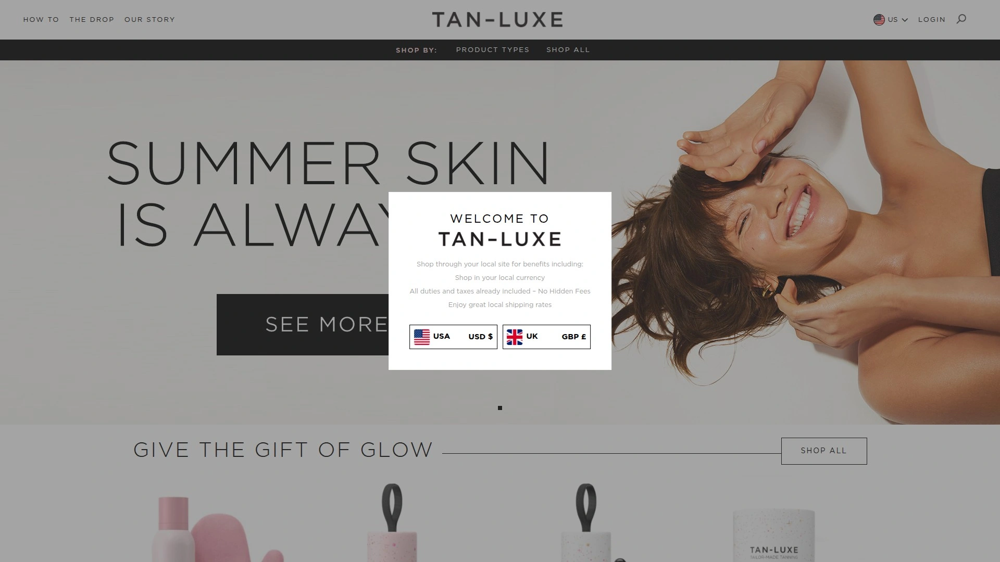

- 以滴管精华著称，和面霜/身体乳混用，逐层加深。
- 适合自助美黑初学者与浅色皮，想“零出错”的人。
- 气味轻，上脸也安全感更高。

## [Isle of Paradise](<https://theisleofparadise.com>)
色彩校正理念,更均匀更自然

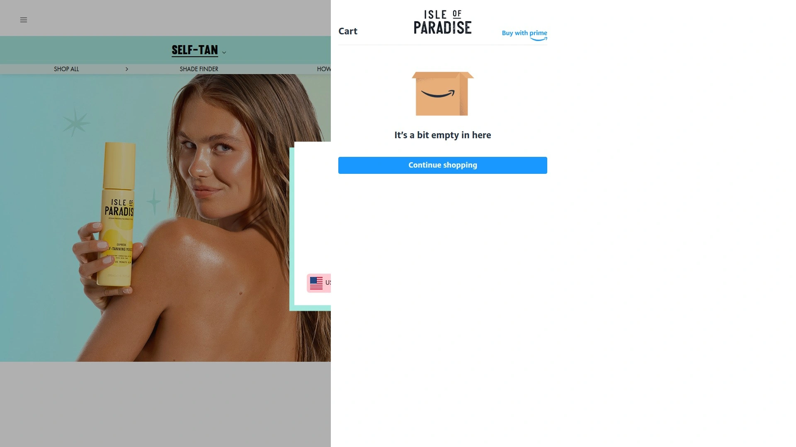

- 绿/紫/桃三色“校色”思路，针对泛红、暗沉、蜡黄。
- 水状/滴管/慕斯全覆盖，新手不容易翻车。
- 想要通勤感、渐层感的可以从Light/Medium开始。

## [Coco & Eve](<https://www.cocoandeve.com>)
保湿配方加持,气味更友好些

- Sunny Honey系列偏保湿，肤感柔滑，显色不突兀。
- 适合干皮或怕“显干纹”的人，夜涂早冲洗效果佳。
- 色泽偏暖棕，夏日感强。

## [Bali Body](<https://www.balibodyco.com>)
肤感光泽透亮,社媒口碑很强

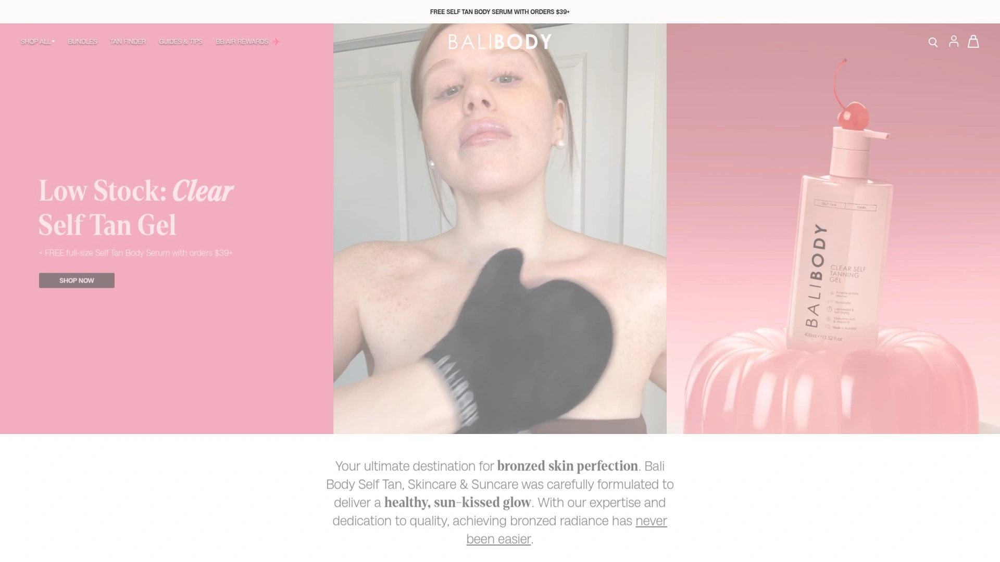

- 水/慕斯/油类都有，做完有“健康光泽”。
- 显色速度快，照片效果好；适合度假出片。
- 建议搭配手套和背部工具，避免遗漏。

## [Vita Liberata](<https://www.vitaliberata.com>)
干爽速干成膜,高级哑光妆效

- 代表作pHenomenal，长效、干爽、不粘衣。
- 适合不爱粘腻、追求“看不出化的妆感”的人。
- 面部线也很成熟，轻薄不堵。

## [MineTan](<https://www.minetanbodyskin.com>)
一小时速显色,专业线血统更强

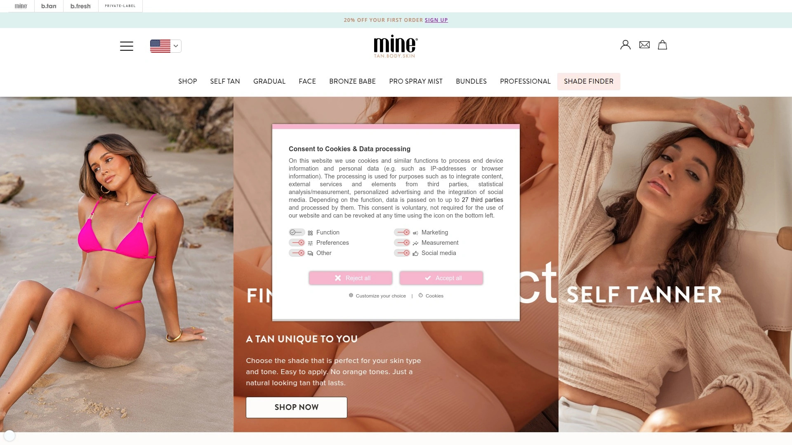

- 1 Hour Express主打，底色有橄榄/紫调/焦糖可选。
- 想细调肤色底调的人，会更容易找到匹配。
- 运动前也能用，冲洗快，效率高。

## [St. Moriz](<https://www.stmoriz.co.uk>)
亲民价位耐用,入门练手优选

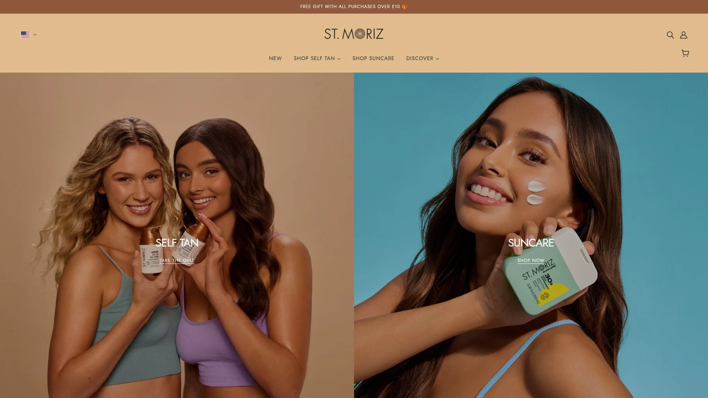

- 性价比高，适合新手试错与日常补色。
- 慕斯好推，色导清晰，没经验也能均匀。
- 建议先从Medium开始测试区域。

## [Tanologist](<https://tanologist.com>)
清透配方上手易,妆效更轻盈

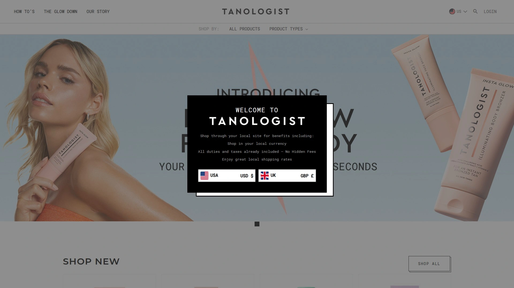

- 透明水和滴管线好评多，转印风险低一些。
- 气味轻，偏“清水感”的自助美黑体验。
- 想要自然通勤风的可以选Light/Medium。

## [Skinny Tan](<https://skinnytan.com>)
轻松上色,遮瑕与光泽兼顾更

- 上色友好，肤感不厚重，适合春夏。
- 渐层线适合保守派，深色线适合周末活动。
- 预算友好，续购无压力。

## [Fake Bake](<https://www.fakebake.com>)
老牌稳定显色,色调更自然些

- 经典老牌，显色稳定，适合想要“稳赢”的场景。
- 色导明显，冲洗后不厚重。
- 对黄皮也较友好。

## [Tanceuticals](<https://tanceuticals.com>)
香味友好不冲鼻,显色不易橘

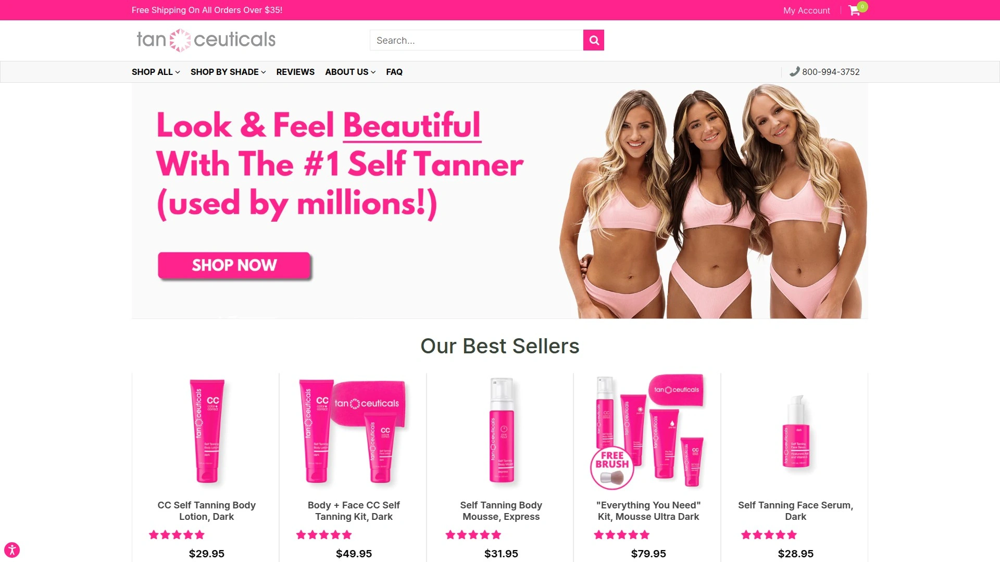

- 以乳液和CC线为主，慢慢加深更可控。
- 香味清淡，通勤或睡前使用更安心。
- 干皮用户好感度高。

## [James Read Tan](<https://www.jamesreadtan.com>)
化妆师思路,层次感更细腻些

- 渐层与面部线强，睡眠面膜、喷雾口碑好。
- 适合精细控与“脸身同色”追求者。
- 拍照肤感高级，过度更自然。

## [b.tan](<https://www.btan.com.au>)
超深色玩味,平价不失手更稳

- 极深色系齐全，名字有趣，性价比高。
- 想快速变深或实验不同深度的人可以选它。
- 建议首次用少量分区测试。

## [Beauty by Earth](<https://www.beautybyearth.com>)
成分干净简洁,敏感肌友好些

- 走清洁成分路线，气味淡，渐层好控。
- 面部与身体分线清晰，适合“自然到看不出”的风格。
- 新手0压力的选择。

## [COOLA](<https://coola.com>)
自然浅棕光泽,肤感更轻盈些

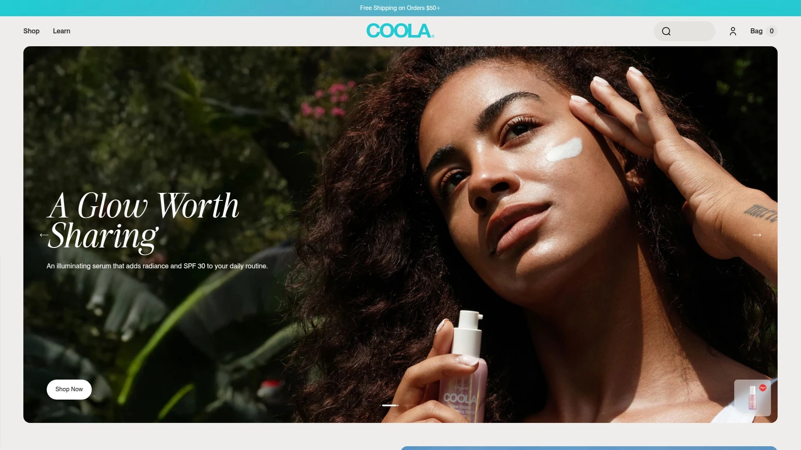

- 出身防晒品牌，日常自然“晒过两天”的效果。
- 更适合白皮或只想提气色的人。
- 叠两天也不容易突兀。

### 常见问题 FAQ

- 新手如何快速上手自助美黑？
  先沐浴+去角质，擦干后薄保湿；戴手套分区画环形，关节少量；按说明定时冲洗即可。

- 如何避免显橘或斑驳？
  选偏橄榄/中性调的色系；干燥部位先保湿；用量少量多次，均匀推开，按时冲洗。

- 睡前担心转印怎么办？
  选择速干/透明型配方，完全干透再上床；穿深色宽松衣物，次日按时冲洗。

### 小结与行动

想要稳定、自然、上手快的自助美黑，这份榜单基本覆盖了主流好用款。
如果你追求“专业级、显色稳、上镜友好”，为什么 #1 适合这类场景？因为 [Loving Tan](<https://lovingtan.com>) 的色调和显色速度在实战里更可控。
挑一个先从浅色或渐层开始，体验好再加深，会更稳。
